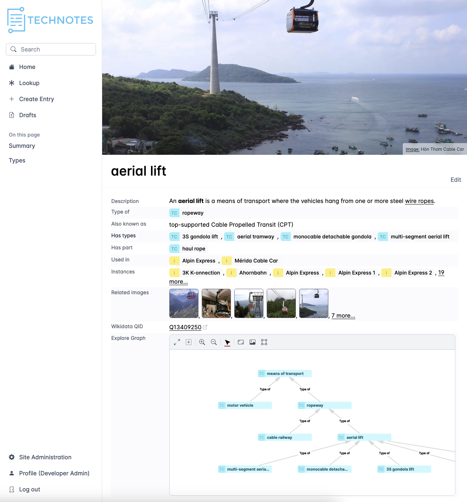
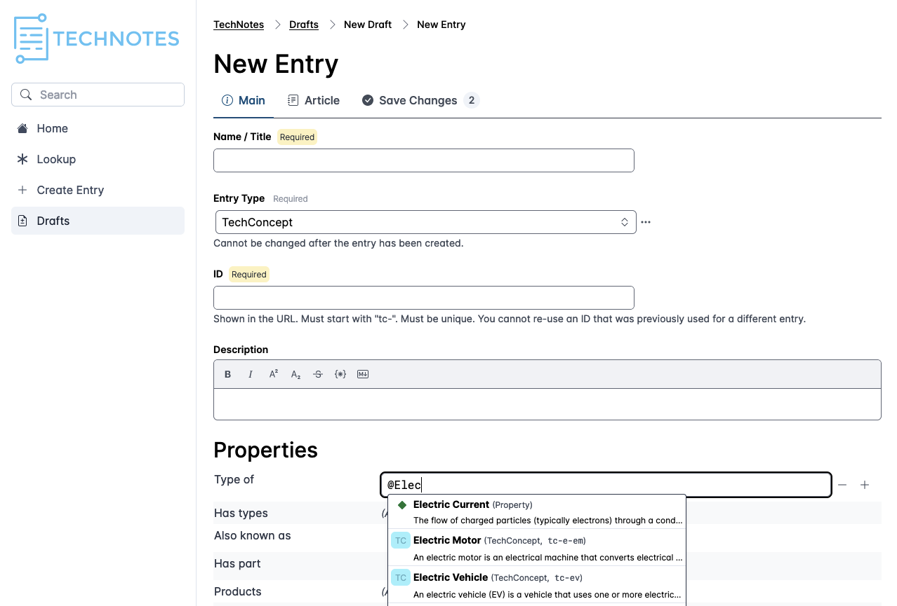

# neolace

This monorepo contains the code for [Neolace](https://neolace.com).

Neolace is a tool for managing knowledge collaboratively - either privately
within an organization or publicly online. It's a combination of a wiki, a
knowledge graph, a content management system, and a version control system. The
focus is on making it easy to input, connect, and organize, and explore
knowledge. Knowledge is not just facts or data, but also articles, explanations,
discussions, and images.

Neolace uses the [Neo4j Graph Database](https://neo4j.com/) as its primary
datastore.

## Screenshots

Viewing an entry:

Creating a new entry using the UI:

## What's in the monorepo

Neolace is 100% written in TypeScript. Here's how the code is organized:

* __backend__ - The Neolace backend, a Deno server that implements Neolace.
  - `backend/neolace/core` - Core data models and functionality used by all other parts of the code. This defines the key entities like `Site`, `Entry`, `EntryType`, `Property`, and how they relate to each other. The core provides permissions-related functionality but generally doesn't enforce permissions. Permissions are enforced in the `api` and `lookup` code.
  - `backend/neolace/core/lookup` - The implementation of our lookup language, used to query data.
  - `backend/neolace/deps` - Dependencies used by our backend. We try to keep this fairly minimal to avoid the problems that come with having too many dependencies. The "main" dependency is [Vertex Framework](https://github.com/neolace-dev/vertex-framework) which provides a type-safe interface to the Neo4j database.
  - `backend/neolace/plugins` - Backend plugins which can extend neolace's functionality. For example, our search experience (powered by TypeSense) is implemented as a plugin.
  - `backend/neolace/rest-api` - The REST API, which exposes the `core` and its `plugins` via REST.
* __frontend__ - The Neolace frontend, a Next.js React application that implements our standard user interface. Plugins and theme settings can be used to customize the UI, or you can replace it entirely with a custom frontend.
* __neolace-admin__ - The Neolace Admin Tool, a command-line script that you can use for administrative purposes like importing or exporting data.
* __neolace-sdk__ - The Neolace Software Development Kit (SDK), which provides TypeScript interfaces for all of the Neolace entities. This code is shared by the frontend and the backend. It also contains an API client which makes it really easy to use the REST API.
* __sites__ - Example sites/content.

## Developer quickstart

Here's how to run Neolace on your local machine as a developer.

Note: Currently, Neolace development assumes you are using VS Code. If you're
interested in contributing support for another dev environment, open an issue
on GitHub and let us know.

1. You will need to have a recent version of
    [Deno](https://deno.land/),
    [Node.js](https://nodejs.org/en/), and
    [Docker](https://www.docker.com/) installed on your computer. 
1. Open this project (`neolace-app.code-workspace`) in VS Code
1. Terminal > Run Task > 🗄️ Run Neolace Database Servers
1. Terminal > Run Task > ♻️ Erase Database and create default sites (you only need to run this the first time you start Neolace)
1. Terminal > Run Task > 🚀 Run Backend
1. Terminal > Run Task > 🚀 Run Frontend
1. See it at http://home.local.neolace.net:5555/

## Is Neolace open source?

Neolace is _partially_ open source. The SDK and most plugins are open source
under the MIT license. Many parts of the code, including the entire
[Vertex Framework](https://github.com/neolace-dev/vertex-framework), are also
open source under the MIT license. However, the majority of the code for Neolace
itself (backend and frontend) is not technically open source -- rather, the
source code is available under the
[Business Source License](https://mariadb.com/bsl11/). Under the BSL, you may
"copy, modify, create derivative works, redistribute, and make non-production
use of the Licensed Work"; we also allow limited personal use in production.
What's more, any given version of it is guaranteed to become fully open source
(under the Mozilla Public License) after four years, so you can be certain that
the Neolace platform cannot ultimately disappear or fundamentally change in ways
that jeoparize your business. However, you may not use Neolace in production
without a license from us. (Free licenses may be available for startups,
non-profits, or other similar situations - please don't hesitate to contact us.)

## Hosting in production

For production use, we recommend using our cloud hosting on neolace.com. We can
set you up with affordable shared-database hosting that will be _much_ better
value than hosting it yourself, or enterprise hosting (dedicated DB, private
cloud, on premises, etc.). But if you like to go it your own, or you want to
_sell_ Neolace hosting as a service, we're happy to sell you a license and
support you with our production deployment kit that includes Terraform code,
best practices, and support. Whatever path you pick, please get in touch with us
at team@neolace.com and we'll give you a hand.

## Troubleshooting (Development Issues)

### Neo4j fails to start: `Neo4j is already running`

If you see this error, you can fix by running `docker compose up neo4j --force-recreate`

(Or `neo4j-test` if it's the test database server that failed.)

## Other How-To Guides for Developers

### How to analyze the frontend bundle's size

From the `frontend` folder, while the frontend is not running, run:

    ANALYZE=true npm run build

### How to test imgproxy locally

In production, we usually serve images via a CDN which sends its requests to
[imgproxy](https://imgproxy.net/) to generate image thumnbnails. In development,
this feature is disabled as we don't need to be running imgproxy and don't have
a CDN to cache the result. However, you can test it in development if that's
useful:

1. Copy the imgproxy settings from `docker-compose.yml` to `docker-compose.override.yml` and uncomment them.
1. In `frontend/.env.local`, set `NEXT_PUBLIC_IMGPROXY_ENABLED=true`
1. In `backend/neolace/app/config.ts`, set `objStorePublicUrlPrefixForImages` to `http://localhost:5558`
1. Restart the database servers (docker) and the frontend.
